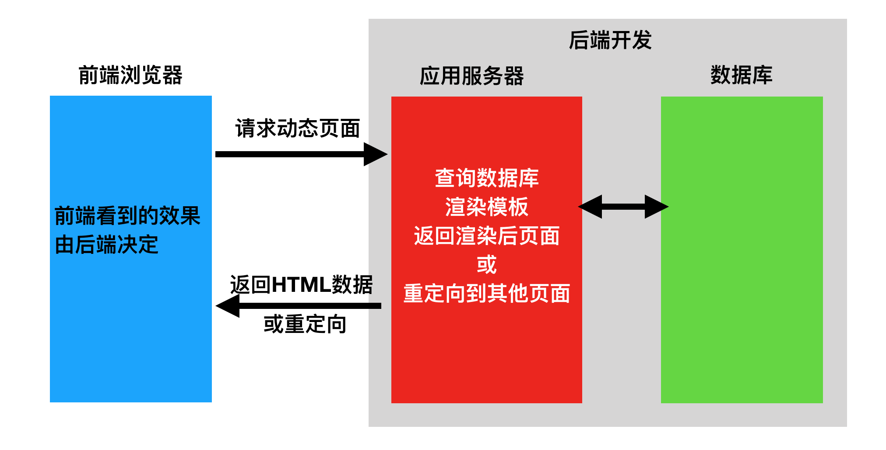

  
  
# Web应用模式
  
  

在开发Web应用中，有两种应用模式：

  * 前后端不分离
  * 前后端分离

  
  
## 1 前后端不分离
  
  

在前后端不分离的应用模式中，前端页面看到的效果都是由后端控制，由后端渲染页面或重定向，也就是后端需要控制前端的展示，前端与后端的耦合度很高。

这种应用模式比较适合纯网页应用，但是当后端对接App时，App可能并不需要后端返回一个HTML网页，而仅仅是数据本身，所以后端原本返回网页的接口不再适用于前端App应用，为了对接App后端还需再开发一套接口。

  
  
## 2 前后端分离
  
  

在前后端分离的应用模式中，后端仅返回前端所需的数据，不再渲染HTML页面，不再控制前端的效果。至于前端用户看到什么效果，从后端请求的数据如何加载到前端中，都由前端自己决定，网页有网页的处理方式，App有App的处理方式，但无论哪种前端，所需的数据基本相同，后端仅需开发一套逻辑对外提供数据即可。

在前后端分离的应用模式中 ，前端与后端的耦合度相对较低。

在前后端分离的应用模式中，我们通常将后端开发的每个视图都称为一个 **接 口**，或者 **API** ，前端通过访问接口来对数据进行增删改查。

[__](../C01-IntroduceToDRF/index.html)[__](../C01-IntroduceToDRF/HowToDesignREST.html)

