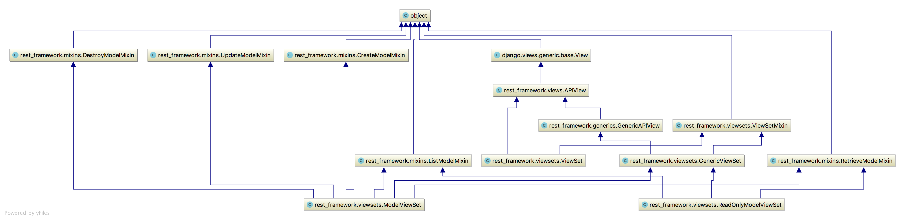

  
  
# 视图集ViewSet
  
  

使用视图集ViewSet，可以将一系列逻辑相关的动作放到一个类中：

  * list() 提供一组数据
  * retrieve() 提供单个数据
  * create() 创建数据
  * update() 保存数据
  * destory() 删除数据

ViewSet视图集类不再实现get()、post()等方法，而是实现动作 **action** 如 list() 、create() 等。

视图集只在使用as_view()方法的时候，才会将 **action** 动作与具体请求方式对应上。如：

    
    
    class BookInfoViewSet(viewsets.ViewSet):
    
        def list(self, request):
            books = BookInfo.objects.all()
            serializer = BookInfoSerializer(books, many=True)
            return Response(serializer.data)
    
        def retrieve(self, request, pk=None):
            try:
                books = BookInfo.objects.get(id=pk)
            except BookInfo.DoesNotExist:
                return Response(status=status.HTTP_404_NOT_FOUND)
            serializer = BookInfoSerializer(books)
            return Response(serializer.data)
    

在设置路由时，我们可以如下操作

    
    
    urlpatterns = [
        url(r'^books/$', BookInfoViewSet.as_view({'get':'list'}),
        url(r'^books/(?P<pk>\d+)/$', BookInfoViewSet.as_view({'get': 'retrieve'})
    ]
    

  
  
## 1\. 常用视图集父类
  
  

  
  
#### 1） ViewSet
  
  

继承自`APIView`与`ViewSetMixin`，作用也与APIView基本类似，提供了身份认证、权限校验、流量管理等。

**ViewSet 主要通过继承ViewSetMixin来实现在调用as_view()时传入字典（如`{'get':'list'}`）的映射处理工作。**

在ViewSet中，没有提供任何动作action方法，需要我们自己实现action方法。

  
  
#### 2）GenericViewSet
  
  

使用ViewSet通常并不方便，因为list、retrieve、create、update、destory等方法都需要自己编写，而这些方法与前面讲过的Mixin扩展类提供的方法同名，所以我们可以通过继承Mixin扩展类来复用这些方法而无需自己编写。但是Mixin扩展类依赖与`GenericAPIView`，所以还需要继承`GenericAPIView`。

**GenericViewSet**
就帮助我们完成了这样的继承工作，继承自`GenericAPIView`与`ViewSetMixin`，在实现了调用as_view()时传入字典（如`{'get':'list'}`）的映射处理工作的同时，还提供了`GenericAPIView`提供的基础方法，可以直接搭配Mixin扩展类使用。

举例：

    
    
    from rest_framework import mixins
    from rest_framework.viewsets import GenericViewSet
    from rest_framework.decorators import action
    
    class BookInfoViewSet(mixins.ListModelMixin, mixins.RetrieveModelMixin, GenericViewSet):
        queryset = BookInfo.objects.all()
        serializer_class = BookInfoSerializer
    

url的定义

    
    
    urlpatterns = [
        url(r'^books/$', views.BookInfoViewSet.as_view({'get': 'list'})),
        url(r'^books/(?P<pk>\d+)/$', views.BookInfoViewSet.as_view({'get': 'retrieve'})),
    ]
    

  
  
#### 3）ModelViewSet
  
  

继承自`GenericViewSet`，同时包括了ListModelMixin、RetrieveModelMixin、CreateModelMixin、UpdateModelMixin、DestoryModelMixin。

  
  
#### 4）ReadOnlyModelViewSet
  
  

继承自`GenericViewSet`，同时包括了ListModelMixin、RetrieveModelMixin。

  
  
## 2\. 视图集中定义附加action动作
  
  

在视图集中，除了上述默认的方法动作外，还可以添加自定义动作。

举例：

    
    
    from rest_framework import mixins
    from rest_framework.viewsets import GenericViewSet
    from rest_framework.decorators import action
    
    class BookInfoViewSet(mixins.ListModelMixin, mixins.RetrieveModelMixin, GenericViewSet):
        queryset = BookInfo.objects.all()
        serializer_class = BookInfoSerializer
    
        def latest(self, request):
            """
            返回最新的图书信息
            """
            book = BookInfo.objects.latest('id')
            serializer = self.get_serializer(book)
            return Response(serializer.data)
    
        def read(self, request, pk):
            """
            修改图书的阅读量数据
            """
            book = self.get_object()
            book.bread = request.data.get('read')
            book.save()
            serializer = self.get_serializer(book)
            return Response(serializer.data)
    

url的定义

    
    
    urlpatterns = [
        url(r'^books/$', views.BookInfoViewSet.as_view({'get': 'list'})),
        url(r'^books/latest/$', views.BookInfoViewSet.as_view({'get': 'latest'})),
        url(r'^books/(?P<pk>\d+)/$', views.BookInfoViewSet.as_view({'get': 'retrieve'})),
        url(r'^books/(?P<pk>\d+)/read/$', views.BookInfoViewSet.as_view({'put': 'read'})),
    ]
    

  
  
## 3\. action属性
  
  

在视图集中，我们可以通过action对象属性来获取当前请求视图集时的action动作是哪个。

例如：

    
    
    def get_serializer_class(self):
        if self.action == 'create':
            return OrderCommitSerializer
        else:
            return OrderDataSerializer
    

  
  
## 4\. 视图集的继承关系
  
  

[__](../C04-View/ViewIntroduction.html)[__](../C04-View/Routers.html)

