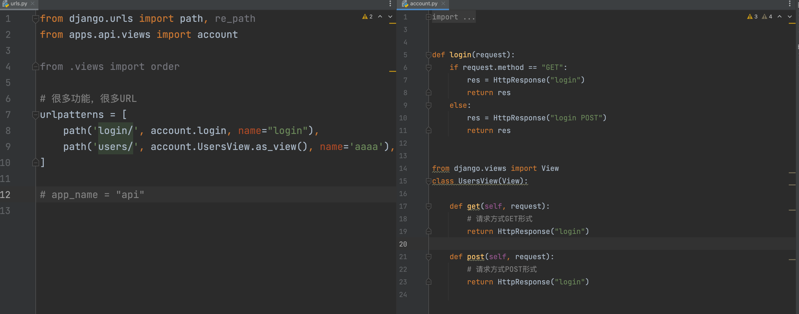

## request参数
```python
from django.shortcuts import HttpResponse


def login(request):
    # 1.当前URL  /api/login/
    print(request.path_info)

    # 2.URL传递的参数
    print(request.GET)
    print(request.GET.get("age"))

    # 3.请求方式  GET/POST
    print(request.method)

    # 4.如果post请求，传递请求体（原始数据）
    print(
        request.body)  # b'{"code":"083Sjmll2yla694F3bll2DguCM2SjmlG","unionId":"oP6QCsyT_9bk1dfSaVf0GEV5Y-yE"}'  b'v1=123&v2=456'

    # 4.1 请求体+请求头       b'v1=123&v2=456'  +  content-type:application/x-www-form-urlencoded
    print(request.POST)
    print(request.POST.get("v1"))
    print(request.POST.get("v2"))

    # 4.2 请求体+请求头   文件
    print(request.FILES)  # 文件格式           + multipart/form-data
    print(request.FILES.get("n1"))
    print(request.FILES.get("n2"))

    # 5.请求头
    # {'Content-Length': '', 'Content-Type': 'text/plain', 'Host': '127.0.0.1:8000', 'Connection': 'keep-alive', 'Cache-Control': 'max-age=0', 'Sec-Ch-Ua': '" Not A;Brand";v="99", "Chromium";v="102", "Google Chrome";v="102"', 'Sec-Ch-Ua-Mobile': '?0', 'Sec-Ch-Ua-Platform': '"macOS"', 'Upgrade-Insecure-Requests': '1', 'User-Agent': 'Mozilla/5.0 (Macintosh; Intel Mac OS X 10_15_7) AppleWebKit/537.36 (KHTML, like Gecko) Chrome/102.0.0.0 Safari/537.36', 'Accept': 'text/html,application/xhtml+xml,application/xml;q=0.9,image/avif,image/webp,image/apng,*/*;q=0.8,application/signed-exchange;v=b3;q=0.9', 'Sec-Fetch-Site': 'none', 'Sec-Fetch-Mode': 'navigate', 'Sec-Fetch-User': '?1', 'Sec-Fetch-Dest': 'document', 'Accept-Encoding': 'gzip, deflate, br', 'Accept-Language': 'zh-CN,zh;q=0.9,en;q=0.8,zh-TW;q=0.7', 'Cookie': 'csrftoken=CdidpKSGbLxzmOXnbmlkvrZep1eJmKLAA81T73UjcjxEnMOa4YOZqtc849AkYfUy'}
    print(request.headers)

    # 5.1 请求头有个特殊的cookie
    # request.headers['cookie']  # 'csrftoken=CdidpKSGbLxzmOXnbmlkvrZep1eJmKLAA81T73UjcjxEnMOa4YOZqtc849AkYfUy;session=xxxx'
    # {'csrftoken': 'CdidpKSGbLxzmOXnbmlkvrZep1eJmKLAA81T73UjcjxEnMOa4YOZqtc849AkYfUy'}
    print(request.COOKIES)

    # 6.requests中其他值
    print(request.resolver_match)

    return HttpResponse("login")

```
### 返回值
- HttpResponse
- JsonResponse
- render
- redirect

```python
from django.shortcuts import HttpResponse, redirect, render
from django.http import JsonResponse


def auth(request):
    pass


def login(request):
    # 1.获取请求数据
    print(request)

    # 2.根据请求数据进行条件的判断 GET/POST   GET.get("xx")    POST.get("xx")

    # 3.返回数据

    # 3.1 字符串/字节/文本数据（图片验证码）
    # return HttpResponse("login")

    # 3.2 JSON格式（前后端分离、app小程序后端、ajax请求）
    # data_dict = {"status": True, 'data': [11, 22, 33]}
    # return JsonResponse(data_dict)

    # 3.3 重定向
    # return redirect("https://www.baidu.com")
    # return redirect("http://127.0.0.1:8000/api/auth/")
    # return redirect("http://127.0.0.1:8000/api/auth/")
    # return redirect("/api/auth/")
    # return redirect("/api/auth/")  # name
    #
    # from django.urls import reverse
    # url = reverse("auth")
    # return redirect(url)  # name
    # return redirect("auth")

    # 3.4 渲染
    # - a.找到 'login.html' 并读取的内容，问题：去哪里找？
    # -   默认先去settings.TEMPLATES.DIRS指定的路径找。（公共）
    # -   按注册顺序每个已注册的app中找他templates目录，去这个目录中寻找'login.html'
    # -   一般情况下，原则，那个app中的的模板，去哪个那个app中寻找。
    # - b.渲染（替换）得到替换完成的字符串
    # - c.返回浏览器
    return render(request, 'api/login.html')
```

### 响应头
 ```python
 from django.shortcuts import HttpResponse, redirect, render
from django.http import JsonResponse


def login(request):
    res = HttpResponse("login") #响应体
    res['xx1'] = "hahaha" #自定义响应头
    res['xx2'] = "hahaha"  #自定义响应头
    res['xx3'] = "hahaha"  #自定义响应头

    res.set_cookie('k1',"aaaaaaaa")  #设置cookie
    res.set_cookie('k2',"bbbbbb")

    return res
 ```
## FBV和CBV
- FBV，视图用函数的形式编写（下面的login）。**（目前主流）**
- CBV，视图用类的形式编写(下面的userview)。  **DRF前后端分离时候为主流**
区别：
1. FBV无法根据请求方式来自动调用，需要自行判断。而CBV可以根据请求方式自动调用get还是post的函数。
2. cbv路由需要写`as_view()`，fbv不用
本质一模一样。


## 静态资源
静态资源：

- 开发需要：css、js、图片。

  ```
  - 根目录的 /static/
  - 已经app目录下载 /static/ 文件夹下
  ```

- 媒体文件：用户上传的数据(excel/pdf/video)

  ```
  - 根目录的 /media/
  ```

## 静态文件
```python
INSTALLED_APPS = [
    # 'django.contrib.admin',
    # 'django.contrib.auth',
    # 'django.contrib.contenttypes',
    # 'django.contrib.sessions',
    # 'django.contrib.messages',
    'django.contrib.staticfiles',
    "apps.api.apps.ApiConfig",
    "apps.web.apps.WebConfig",
]
...

STATIC_URL = '/static/'
STATICFILES_DIRS = (
    os.path.join(BASE_DIR, 'static'),
)
```
- 顺序：...

- 多app开发：各自app的图片放在各自  `/static/app名字/。。。`

- 在开发过程中
- 禁止

  ```html
  
  ```

- 建议
```html


<!DOCTYPE html>
<html lang="en">
<head>
    <meta charset="UTF-8">
    <title>Title</title>
</head>
<body>
<h1>登录页面</h1>
<a href="/xxx/xxxxx/">调换dao xx</a>
<a href="">跳转</a>


</body>
</html>
```