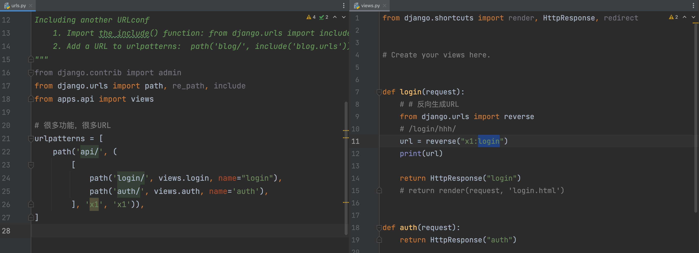
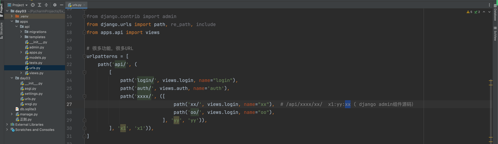

## 传统路由写法
urls.py是主路由 app中的是需要分发的路由
```python
urlpatterns=[
    path('home/', views.home)
]
```

views是视图，对应views.py中的def home函数，有传参数时,函数中可以用`request.GET.get(nid)`拿到nid。
里面的int代表整数，也可以用str字符串和slg，uuid, path。参数id是数字，用int，是字符串时，用str。slug代表字幕+数字+下划线+-。uuid代表随机生成的值。 path代表一个路径，可以包含 / 
```python
urlpatterns=[
    path('news/<int:nid>/', views.news) 
]
def news(request,nid):
    nid=request.GET.get(nid)
    #...
```
## 正则路由写法
`\d`代表数字，+代表后面的所有
`\w`代表字符串
`(\w+-\d+)/  127.0.0.1:8000/users/2000-1`  打印参数为2000-1
`(?P<xxxxid>\w+-\d+)/(?P<yiiiid>\d+)/`   设置参数值为xxxxid和yiiiid
```python

urlpatterns=[
    re_path(r'users/(\d+)/', views.users) 
]

def users(request,xid):
   print(xid)
    #...
```
## 路由分发
1. inlucde + app（一般），将功能拆分不到不同的app中。
2. 手动路由分发，可以与app无关。
include 做路由分发功能，此时应有多个app。如果没有app，可以直接views.xxx
当有多个共同前缀时候，可以写成元组，避免重复编写
```python
urlpatterns=[
   path('user/add/',views.login),
   path('user/del/',views.login),
   path('user/edit/',views.login),
   path('user/list/',views.login)
]
# 可以简写成如下方式
urlpatterns=[
   path('user/ ', ([
    path('add/',views.login),
   path('del/',views.login),
   path('edit/',views.login),
   path('list/',views.login)
   ],None.None)),
     
]
```
## reverse+name
反向生成url
```python

urlpatterns=[
     path('login/<str:role>/', views.login,name='v1') 
     path(r'auth/(\d+)/(\w+)', views.login,name='v2') 
]

def login(request,role):
   url=reverse('v1',kwargs={'role':'hhh'})
   print(url) #/login/hhh
#......
   url=reverse('v2',args=(666,'ppp'))
    print(url) # /auth/666/ppp
    #...
```
## namespace

辅助name。

- 主路由

  ```python
  from django.urls import path, re_path, include
  
  # 很多功能，很多URL
  urlpatterns = [
      path('api/', include("apps.api.urls",namespace='x1')),
      path('web/', include("apps.web.urls",namespace='x2')),
  ]
  ```

- api/urls.py

  ```python
  from django.urls import path, re_path
  from . import views
  # 很多功能，很多URL
  urlpatterns = [
      path('login/', views.login,name="login"),
      path('auth/', views.auth, name='auth'),
  ]
  ```

- web/urls.py

  ```python
  from django.urls import path, re_path
  from . import views
  # 很多功能，很多URL
  urlpatterns = [
      path('home/', views.home,name='home'),
      path('order/', views.order,name='order'),
      path('auth/', views.order, name='auth'),
  ]
  ```


以后再某个URL或者视图中反向生成：

```python
from django.urls import reverse
url = reverse("x1:login")    # /api/login/
url = reverse("x1:order")    # /web/login/

url = reverse("x1:auth")    # /api/login/
url = reverse("x2:auth")    # /web/login/
```


两个扩展：

- namespace需要设置app_name

  ```python
  urlpatterns = [
      path('api/', include("apps.api.urls", namespace='x1')),
  ]
  ```

  ```python
  from django.urls import path, re_path
  from apps.api import views
  
  # 很多功能，很多URL
  urlpatterns = [
      path('login/', views.login, name="login"),
      path('auth/', views.auth, name='auth'),
  ]
  
  app_name = "api"
  ```

- 分发
x1 yy都是namespace，从最外层到最里层
  1:

  

2:多层嵌套



## 当前匹配对象
作用
A用户具有一些权限  permissions=['xx','login','account']

B用户具有的权限  permissions=['xx','login','account']

 
  ```python 
  # 很多功能，很多URL
  urlpatterns = [
      path('login/', views.login, name="login"),
 
  ]
  
 def login:
    permissions=['xx','login','account']
#   判断是否有权限
current_name=request.resolver_match.url_name
if current_name not in permissions
return HttpResponse('无权限') 
  ```

## 相对和绝对导入urls
注意实现：不要再项目根目录做相对导入。

原则：

- 绝对导入
- 相对导入（层级深）

